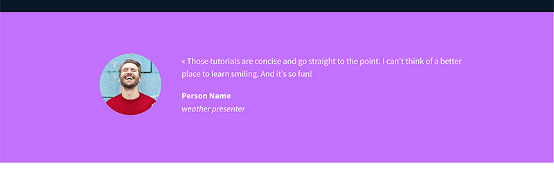
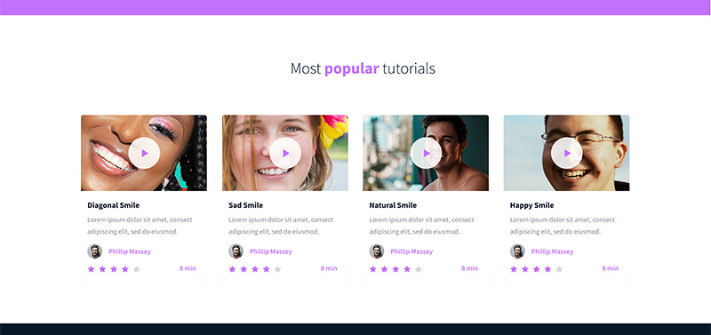
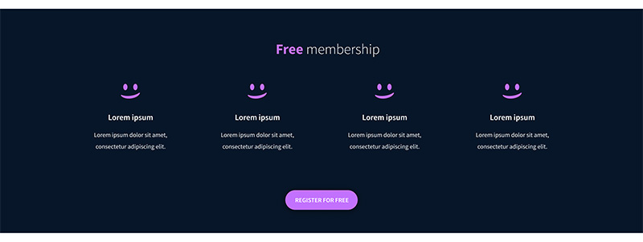
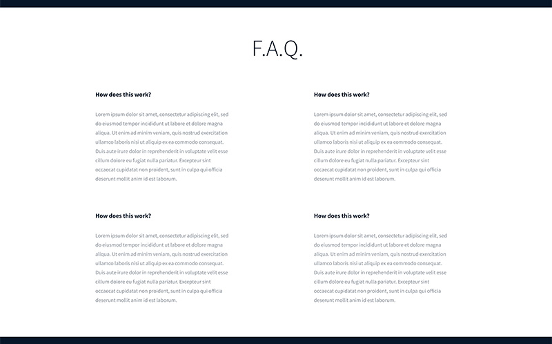

ALX Advanced CSS project

This project is about creating a School page. 
It aims at leavraging the potential of HTML and CSS to impliment a prototype created with FIGMA,

PASTE this link into your browser to access prototype
 https://www.figma.com/proto/dyYL6Ku4WG7vsdpwvlcJZC/Homepage?type=design&node-id=3558-0&t=yHSUZPlFk6coB1xC-0&scaling=min-zoom&page-id=0%3A1 

Tasks

0. README and objectives!
mandatory
This project is following the HTML, advanced project - please make sure all tasks of this previous one are fully done.

For this project, you will focus on the CSS and the style of the page.

This designer file will be available on Figma - feel free to create an account to access the final result here:

Page in Figma
fig file
Images
And “Duplicate to your Drafts” to have access to all design details. (if not already done)

Important notes with Figma:

if your computer doesn’t have missing fonts, you can find them here: source-sans-pro and Spin-Cycle-OT
some values are in float - feel free to round them
For this task, please write an amazing README.md and copy the index.html file from HTML, advanced

Repo:

GitHub repository: alx_html_css
Directory: css_advanced
File: README.md, index.html
 

1. Import the style
mandatory
Before starting the implementation of the Style:

Create the file styles.css
Import styles.css in the head of your index.html
Repo:

GitHub repository: alx_html_css
Directory: css_advanced
File: index.html, styles.css

2. Header and Banner
mandatory
Based on the Figma file, add the correct styling to the header and first section of the page

Reminders:

All colors values, width, height and images are part of the Figma
Keep your CSS simple and clean - use as simple as you can CSS selectors
Be accurate - the final result should be the same as the page at the end!
Repo:

GitHub repository: alx_html_css
Directory: css_advanced
File: styles.css

3. Quotes
mandatory
Based on the Figma file, add the correct styling to the quote section

Tips:

You can start to see similar or common style, time to start to centralize your style and CSS selectors
Repo:

GitHub repository: alx_html_css
Directory: css_advanced
File: styles.css3. Quotes
mandatory

4. Videos list
mandatory
Based on the Figma file, add the correct styling to the videos list section

Repo:

GitHub repository: alx_html_css
Directory: css_advanced
File: styles.css

5. Membership
mandatory
Based on the Figma file, add the correct styling to the membership section

Repo:

GitHub repository: alx_html_css
Directory: css_advanced
File: styles.css

6. FAQ
mandatory
Based on the Figma file, add the correct styling to the FAQ section

Repo:

GitHub repository: alx_html_css
Directory: css_advanced
File: styles.css

7. Footer
mandatory
Based on the Figma file, add the correct styling to the footer

Repo:

GitHub repository: alx_html_css
Directory: css_advanced
File: styles.css